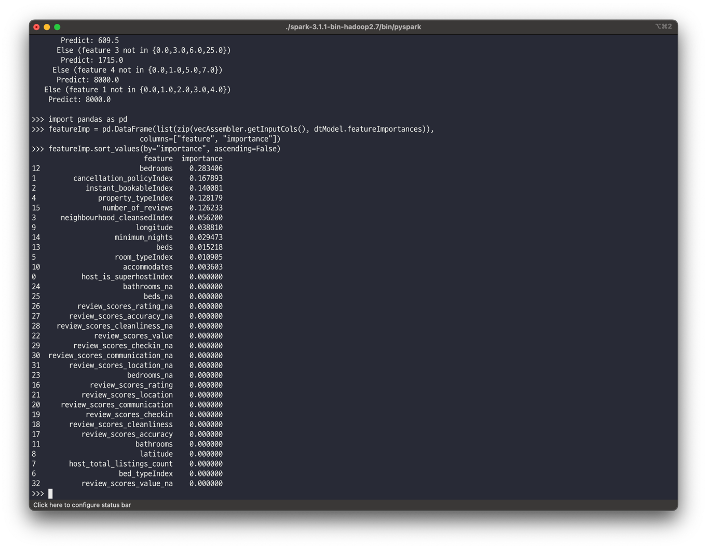

# MLlib을 사용한 머신러닝

## 링크
* https://www.mckinsey.com/industries/retail/our-insights/how-retailers-can-keep-up-with-consumers
* https://spark.apache.org/docs/latest/ml-guide.html
* https://spark.apache.org/docs/latest/ml-pipeline.html
* http://insideairbnb.com/get-the-data.html
* https://github.com/apache/spark/blob/branch-2.4/sql/core/src/main/scala/org/apache/spark/sql/execution/DataSourceScanExec.scala#L430

<br><br>

## 머신러닝이란 무엇인가?
* 통계, 선형 대수 및 수치 최적화를 사용하여 데이터에서 패턴을 추출하는 프로세스
* 지도 학습, 반지도 학습, 비지도 학습, 강화 학습

<br>

### 지도 학습
* 레이블이 연결된 레코드로 학습
* 레이블이 지정되지 않은 입력이 주어지면 출력 레이블을 예측하는 것.
* 출력 레이블은 이산적이거나 연속적일 수 있으며 이것은 분류(classification) 또는 회귀(regression)로 나눠짐.
  * 이진 분류 : 둘 중의 하나로 나누는 것.
  * 다항식 분류 또는 다중 클래스 : 3개 이상의 레이블로 분류하는 것.
  * 회귀 문제는 예측하는 작업인데 예측하는 값은 연속 숫자
* 인기 있는 분류 및 회귀 알고리즘

| 알고리즘                                   | 전형적인 사용 |
|----------------------------------------|---------|
| 선형 회귀(linear regression)               | 회귀      |
| 로지스틱 회귀(logistic regression)           | 분류      |
| 의사결정나무(decision trees)                 | 둘 다     |
| 그레디언트 부스트 트리(gradient boosted tree)    | 둘 다     |
| 랜덤 포레스트(random forest)                 | 둘 다     |
| 나이브 베이즈(Naive Bayes)                   | 분류      |
| 서포트 벡터 머신(support vector machine, SVM) | 분류      |

<br>

### 비지도 머신러닝
* 레이블을 예측한다기보다는 데이터 구조를 잘 이해하는 데 도움이 됨

* 이상값 감지, 지도 머신러닝을 위한 전처리 단계
* k-means, 잠재 디리클레 할당(LDA), 가우시간 모델

<br>

## 왜 머신러닝을 위한 스파크인가?
* 수집, 피처 엔지니어링, 모델 학습 및 배포 등 통합 분석 엔진
* `spark.mllib`, `spark.ml` 
* `spark.mllib` : RDD API를 기반으로 하는 기존 머신러닝 API
* `spark.ml` : 데이터 프레임을 기반으로 하는 최신 API

<br><br>

## 머신러닝 파이프라인 설계
* 파이프라인 API는 변환기(transformer)와 추정기(estimator)로 구성
* 변환기 (Transformer)
  * 데이터 프레임을 입력으로 받아들이고, 하나 이상의 열이 추가된 새 데이터 프레임을 반환.
  * 규칙 기반 변환을 적용해 학습을 위한 데이터를 준비
  * `.transform()` 메서드 이용
* 추정기 (Estimator)
  * `.fit()` 메서드
  * 데이터 프레임에서 학습(또는 피팅)하고 Model 반환
* 파이프라인
  * 일련의 변환기와 추정기를 단일 모델로 구성함

<br>

### 데이터 수집 및 탐색
* 임대 부동산의 1박당 가격을 예측
```python
filePath = "LearningSparkV2-master/databricks-datasets/learning-spark-v2/sf-airbnb/sf-airbnb-clean.parquet/"
airbnbDF = spark.read.parquet(filePath)
airbnbDF.select("neighbourhood_cleansed", "room_type", "bedrooms", "bathrooms", "number_of_reviews", "price").show(5)
```


<br>

### 학습 및 테스트 데이터세트 생성
* 데이터 세트를 Train 및 Test 두 그룹으로 나눔 (80:20)
* 전체 데이터 세트를 훈련하면 테스트가 안되거나 오버피팅할 수 있음
* 훈련 세트는 종속 변수X와 결과 y로 구성됨. X는 n x d 행렬, y는 n x 1 행렬
* 모델의 성능을 측정하는데 메트릭을 사용함
  * 분류 문제는 정확도 또는 백분율

```python
trainDF, testDF = airbnbDF.randomSplit([.8, .2], seed=42)
print(f"""
There are {trainDF.count()} rows in the training set,
and {testDF.count()} in the test set
""")
```


* executor 수가 변경되면 카탈리스트 옵티마이저는 클러스터 리소스 및 데이터세트 크기에 따라 최적의 방법으로 분할한다.

<br>

### 변환기를 사용하여 기능 준비
* 선형 회귀에서는 모든 입력 기능이 데이터 프레임의 단일 벡터 내에 포함되어야함. 변환해야 함
* 스파크의 변환기는 데이터 프레임을 입력으로 받아들이고 하나 이상의 열이 추가된 새 데이터 프레임을 반환함
* 모든 기능을 단일 벡터에 넣는 작업을 위해 VectorAssembler 변환기를 사용함.
* VectorAssembler는 입력 열 목록을 가져와서 추가 열이 있는 새 데이터 프레임을 만듬
```python
from pyspark.ml.feature import VectorAssembler
vecAssembler =  VectorAssembler(inputCols=["bedrooms"], outputCol="features")
vecTrainDF =  vecAssembler.transform(trainDF)
vecTrainDF.select("bedrooms", "features", "price").show(10)
```


<br>

### 선형 회귀 이해하기
* Linear Regression
* 종속 변수(또는 레이블)와 하나 이상의 독립 변수(피쳐) 간의 선형 관계를 모델링
* y = mx + b + E
* E : 잔차

<br>

### 추정기를 사용하여 모델 구축
* LinearRegression은 추정기의 한 유형.
```python
from pyspark.ml.regression import LinearRegression
lr = LinearRegression(featuresCol="features", labelCol="price")

# fit의 출력은 변환기
lrModel = lr.fit(vecTrainDF)

m = round(lrModel.coefficients[0], 2)
b = round(lrModel.intercept, 2)
print(f"""The formula for the linear regression line is
price = {m}*bedrooms + {b}""")
```


<br>

### 파이프라인 생성
* https://spark.apache.org/docs/latest/api/python/reference/api/pyspark.ml.Pipeline.html?highlight=pipeline#pyspark.ml.Pipeline
* 모델을 테스트 세트에 적용하려면 훈련 세트와 동일한 방식으로  데이터를 준비해야 함.
* 데이터가 통과할 단계를 순서대로 지정하기만 하면 스파크가 알아서 처리함.
```python
from pyspark.ml import Pipeline
pipeline = Pipeline(stages=[vecAssembler, lr])
pipelineModel = pipeline.fit(trainDF)

# 테스트 데이터 세트에 적용
predDF =  pipelineModel.transform(testDF)
predDF.select("bedrooms", "features", "price", "prediction").show(10)
```


**원-핫 인코딩**
* 범주형 값을 숫자값으로 변환하기 위해 원-핫 인코딩 기술을 사용함.
* 스파크를 사용하면 원-핫 인코딩이 메모리/컴퓨팅 리소스 소비를 증가시키지 않는다.
* 원-핫 인코딩 방법
  * StringIndexer 및 OneHotEncoder를 사용
    * StringIndexer를 이용하여 범주형 값을 범주 지수로 변환
    * OneHotEncoder (스파크 2.3, 2.4의 경우 OneHotEncoderEstimator)를 이용하여 범주 인덱스 열을 이진 벡터 열에 매핑
```python
from pyspark.ml.feature import OneHotEncoder, StringIndexer

categoricalCols =  [field for (field, dataType) in trainDF.dtypes if dataType == "string"]
indexOutputCols =  [x + "Index" for x in categoricalCols]
oheOutputCols =  [x + "OHE" for x in categoricalCols]

stringIndexer = StringIndexer(inputCols=categoricalCols,
                              outputCols=indexOutputCols,
                              handleInvalid="skip")
oheEncoder  =  OneHotEncoder(inputCols=indexOutputCols,
                             outputCols=oheOutputCols)

numericCols = [field for (field, dataType) in trainDF.dtypes 
               if ((dataType == "double") & (field != "price"))]

assemblerInputs = oheOutputCols + numericCols
vecAssembler =  VectorAssembler(inputCols=assemblerInputs,
                                outputCol="features")
```
* StringIndexer가 새로운 범주를 처리하는 방법 --> handleInvalid 매개변수 이용
  * 건너뛰기 : 잘못된 데이터가 있는 행 필터링
  * 오류 : 오류 발생
  * 유지 : 인덱스 numLables의 특수 추가 버킷에 잘못된 데이터를 넣음.
* RFormula를 사용하여 건너뛰는 방법
```python
from pyspark.ml.feature import RFormula

rformula = RFormula(formula="price ~ .",
                    featuresCol="features",
                    labelCol="price",
                    handleInvalid="skip")
```
* StringIndexer와 OneHotEncoder를 자동으로 결합하는 RFormula의 단점은 모든 알고리즘에 대해 원-핫 인코딩이 필요하지 않거나 권장되지 않는다는 것.

* 모든 피처 준비 및 모델 구축을 파이프라인에 넣고 데이터 세트에 적용
```python
lr  = LinearRegression(labelCol="price", featuresCol="features")
pipeline = Pipeline(stages = [stringIndexer, oheEncoder, vecAssembler, lr])

pipelineModel = pipeline.fit(trainDF)
predDF = pipelineModel.transform(testDF)
predDF.select("features", "price", "prediction").show(5)
```


<br>

### 모델 평가
* spark.ml에는 분류, 회귀, 클러스터링 및 순위 평가기가 있음.

**RMSE**  
* 0에서 무한대까지의 범위를 나타내는 메트릭
* 0에 가까울수록 좋음
* 평균 제곱급 오차
```python
from pyspark.ml.evaluation import RegressionEvaluator
regressionEvaluator = RegressionEvaluator(
  predictionCol="prediction",
  labelCol="price",
  metricName="rmse"
)
rmse =  regressionEvaluator.evaluate(predDF)
print(f"RMSE is {rmse:.1f}")
```


<br>

**RMSE값 해석**  
* 간단한 기준 모델을 구축하고 비교할 RMSE를 계산
* 훈련 세트 y-bar에서 레이블의 평균값을 계산하고 테스트 데이터에 대해 y를 예측하고 결과 RMSE를 계산하는 것.
* 테이블의 단위는 RMSE에 직접적인 영향을 미침.

<br>

**R^2**  
* R^2 값의 범위는 음의 무한대에서 1까지임.
```python
r2 = regressionEvaluator.setMetricName("r2").evaluate(predDF)
print(f"R2 is {r2}")
```


<br>

### 모델 저장 및 로드
* 나중에 재사용하기 위해 저장
* model.write().save(path)
```python
# 모델 저장
pipelinePath  =  "/tmp/lr-pipeline-model"
pipelineModel.write().overwrite().save(pipelinePath)

# 모델 호출
from pyspark.ml import PipelineModel
savedPipelineModel = PipelineModel.load(pipelinePath)
```


<br>

## 하이퍼파라미터 튜닝
* 하이퍼파라미터 : 훈련 전에 모델에 대해 정의하는 속성. 훈련 과정에서 학습되지 않음. 매개변수 X

<br>

### 트리 기반 모델
* 의사결정나무, 그레디언트 부스트 트리, 랜덤 포레스트
* 해석하기 쉽고 단순하지만 강력한 모델

<br>

**의사결정나무**
* 데이터 마이닝에 적합
* 분류 또는 회귀 작업을 위해 일련의 if-then-else 규칙처럼 작동함.


* 루트, 리프, 중간 노드
* 깊이 : 루트 노드에서 리프 노드까지의 가장 긴 경로
* 너무 깊은 나무는 오버피팅 유발, 반대로 너무 얕은 나무는 언더피팅
* 트리 기반 방법은 자연스럽게 범주형 변수를 처리
```python
from pyspark.ml.regression import DecisionTreeRegressor

dt = DecisionTreeRegressor(labelCol="price")
# 숫자 열만 필터링
numericCols = [field for (field, dataType) in trainDF.dtypes if ((dataType == "double") & (field != "price"))]

# 위에서 정의한 StringIndexer의 출력과 숫자 열 결합
assemblerInputs =  indexOutputCols + numericCols
vecAssembler = VectorAssembler(inputCols=assemblerInputs, outputCol="features")

# 단계를 파이프라인으로 결합
stages = [stringIndexer, vecAssembler, dt]
pipeline = Pipeline(stages=stages)
pipelineModel = pipeline.fit(trainDF)
```


* 에러발생. maxBins 매개변수에 문제
* maxBins : 연속 특성이 이산화되거나 분할되는 빈의 수 (기본값 32)
* https://static.googleusercontent.com/media/research.google.com/en//pubs/archive/36296.pdf
* https://cs.stanford.edu/~matei/papers/2016/nips_yggdrasil.pdf
* 36개의 범주형 열이 있었기 때문에 32로 설정되어 있는 maxBins를 변경해야 함.
```python
dt.setMaxBins(40)
pipelineModel = pipeline.fit(trainDF)

# if-then-else 규칙 추출
dtModel = pipelineModel.stages[-1]
print(dtModel.toDebugString)
```


* 모델에서 기능 중요도 점수를 추출할 수 있음
```python
import pandas as pd

featureImp = pd.DataFrame(list(zip(vecAssembler.getInputCols(), dtModel.featureImportances)),
                          columns=["feature", "importance"])
featureImp.sort_values(by="importance", ascending=False)
```



<br>

**랜덤 포레스트**
* 앙상블 : 많은 모델을 만들고 예측을 결합/평균하는 것
* 랜덤 포레스트는 두 가지 주요 개선을 할 수 있는 의사결정나무의 앙상블
  * 행별로 샘플 부트스트랩
    * 부트스트래핑 : 원본 데이터에서 대체하고 샘플링하여 새 데이터를 시뮬레이션하는 기술.
    * 배깅 : 부트스트랩 샘플에 대해 훈련하여 다른 의사결정나무를 생성하고 예측을 집계
  * 열별 무작위 기능 선택
    * 배깅의 단점은 트리가 모두 상관관계가 높기 때문에 유사한 패턴을 학습
    * 분할을 수행할 때마다 열의 하위 집합만 고려함
* 랜덤 포레스트 및 의사겨정나무 API는 회귀 또는 분류 모두 적용 가능함
```python
from pyspark.ml.regression import RandomForestRegressor
rf  = RandomForestRegressor(labelCol="price", maxBins=40, seed=42)
```

* 랜덤 포레스트를 훈련시킨 후에는 앙상블에서 훈련된 다양한 트리를 통해 새로운 데이터 포인트를 전달 가능

