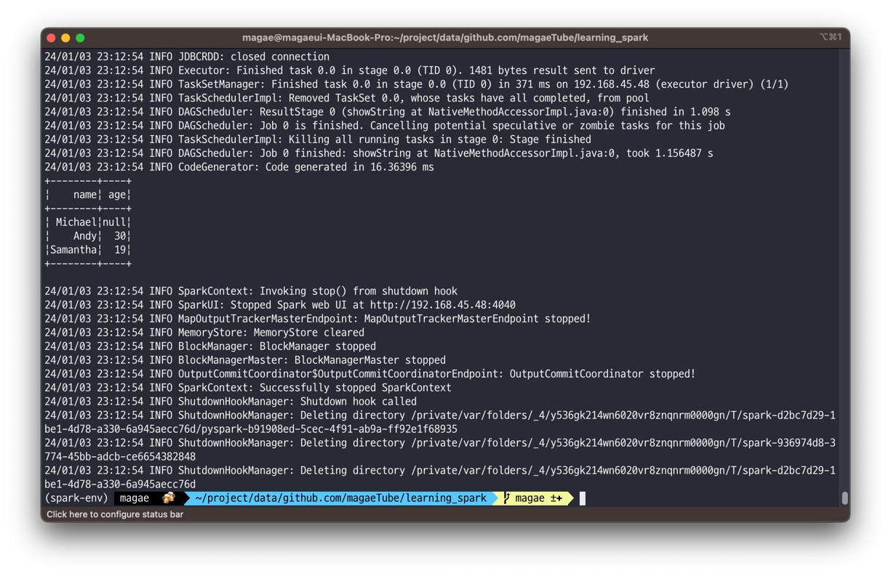

# 5장. 스파크 SQL과 데이터 프레임: 외부 데이터 소스와 소통하기

## 스파크 SQL과 아파치 하이브
* 스파크 SQL은 관계형 처리와 함수형 프로그래밍 API를 통합하는 아파치 스파크의 기본 구성 요소다.
* 스파크 SQL을 사용하면 스파크 프로그래머는 더 빠른 성능 및 관계형 프로그래밍의 이점을 활용할 수 있을 뿐만 아니라 복잡한 분석 라이브러리를 호출할 수 있다.

### 사용자 정의함수
* 스파크는 내장함수를 제공하기도 하지만, 자신의 기능을 정의할 수 있는 사용자 정의 함수 (User-Defined Function, UDF)를 제공한다.

### 스파크 SQL UDF
```Scala
import org.apache.spark.sql.SparkSession
val spark = SparkSession.builder
                        .appName("UDFTest")
                        .getOrCreate()
                       
// 큐브 함수 생성
val cubed = (s: Long) => s * s * s

// UDF로 등록
spark.udf.register("cubed", cubed)

// 임시 뷰 생성
spark.range(1, 9).createOrReplaceTempView("udf_test")

// 큐브 UDF를 사용하여 쿼리
spark.sql("SELECT id, cubed(id) AS id_cubed FROM udf_test").show()
```

```Python
from pyspark.sql.types import LongType
from pyspark.sql import SparkSession

spark = (SparkSession.builder
                     .appName("SparkSQLExampleApp")
                     .getOrCreate())
                     
def cubed(s):
    return s * s * s
    
spark.udf.register("cubed", cubed, LongType())
spark.range(1, 9).createOrReplaceTempView("udf_test")
spark.sql("SELECT id, cubed(id) AS id_cubed FROM udf_test").show()             
```


### 스파크 SQL에서 평가 순서 및 null 검사
* 스파크 SQL은 where에서 평가순서를 보장하지 않음
  * null 검사를 수행하기 위해 UDF 내부에서 null검사를 수행하거나 IF 또는 CASE WHEN 식을 이용하여 null 검사를 수행

### 판다스 UDF로 PySpark UDF 속도 향상 및 배포
* PySpark UDF는 일반적으로 Scala UDF보다 느리다. (JVM과 파이썬 사이의 데이터 이동을 필요로 해서) 이를 해결하기 위해 Pandas UDF (벡터화된 UDF)를 이용하여 해결할 수 있다.
* 두 가지 API인 Pandas UDF 또는 Pandas 함수 API로 분할됨

```Python
# Pandas 가져오기
import pandas as pd

from pyspark.sql.functions import col, pandas_udf
from pyspark.sql.types import LongType
from pyspark.sql import SparkSession

spark = (SparkSession.builder
                     .appName("SparkSQLExampleApp")
                     .getOrCreate())
                     
# 큐브 함수 선언
def cubed(a: pd.Series) -> pd.Series:
    return a * a * a
    
# 큐브 함수에 대한 판다스 UDF 생성
cubed_udf = pandas_udf(cubed, returnType=LongType())

# 판다스  시리즈 생성
x = pd.Series([1, 2, 3])

# 로컬 판다스 데이터를 실행하는 pandas_udf에 대한 함수
print(cubed(x))

# 스파크 데이터 프레임 생성
df = spark.range(1, 4)

# 벡터화된 스파크 UDF를 함수로 실행
df.select("id", cubed_udf(col("id"))).show()              
```


파이썬 관련 패키지 설치 후 재수행 (Pandas, Pyarrow, cmake) 


## 스파크 SQL 셸, 비라인 및 태블로로 쿼리하기

### 스파크 SQL 셸 사용하기
* spark-sql CLI를 이용. 로컬 모드에서  하이브 메타스토어 서비스와 통신하는 대신 Thrift JDBC/ODBC서버와는 통신하지 않는다.
```shell
# 스파크 SQL CLI 실행
./bin/spark-sql

# 테이블 만들기
CREATE TABLE people (name STRING, age INT);

# 테이블에 데이터 삽입하기
INSERT INTO people VALUES ("Michael", NULL);
INSERT INTO people VALUES ("Andy", 30);
INSERT INTO people VALUES ("Samantha", 19);

# 스파크 SQL 쿼리 실행하기
SHOW TABLES;
SELECT * FROM people WHERE age < 20;
SELECT name FROM people WHERE age IS NULL;
```


### 비라인 작업
* Beeline은 SQLLine CLI를 기반으로 하는 JDBC 클라이언트다.

### 태블로로 작업하기
* ...

## 외부 데이터 소스
### JDBC 및  SQL 데이터베이스
* JDBC를 이용하여 다른 데이터베이스에서 데이터를 읽을수 있음
* 시작하기 위해서는 JDBC 드라이버를 지정해야함
```shell
./bin/spark-shell --driver-class-path $database.jar --jars $database.jar
```

* 연결 속성

|속성명|설명|
|----|---|
|user, password|데이터 원본에  로그인하기  위한 연결  속성|
|url|JDBC 연결 URL|
|dbtable|JDBC 테이블. "dbtable"과  "query" 옵션을 동시에 지정할 수 없음|
|query|데이터를 읽는데 사용되는 쿼리|
|driver|JDBC 드라이버 클래스명|

**파티셔닝의 중요성**
*  많은 양의 데이터를 전송할 때 데이터 소스를 분할해야 한다.
* 파티셔닝 연결 속성

|속성명|설명|
|----|---|
|numPartitions|최대 파티션 수이자 최대 동시 JDBC 연결 수를 결정함|
|partitionColumn|파티션을 결정하는 컬럼으로 숫자, 날짜 또는 타임스탬프 컬럼이어야함|
|lowerBound|파티션 열의 최솟값|
|upperBound|파티션 열의 최댓값|

* 팁
  * numPartitions는 스파크 워커 수의배수를 사용하는 것.
  * partitionColumn의 실제 값을 기준으로 lowerBound 및 upperBound를 계산
  * 데이터 스큐를 방지하기 위해 분산될 수 있는 partitionColumn을 선택

## PostgreSQL
* jar 설정으로 실행
```shell
./bin/spark-shell --jars postgresql-42.2.6.jar
```

```scala
import org.apache.spark.sql.SparkSession
val spark = SparkSession.builder
                        .appName("SparkSQLExampleApp")
                        .getOrCreate()

// 로드 함수를 사용하여 JDBC 소스로부터 데이터를 로드
val  jdbcDF1 = spark.read.format("jdbc")
                         .option("url", "jdbc:postgresql:[DBSERVER]")
                         .option("dbtable", "[SCHEMA].[TABLENAME]")
                         .option("user", "[USERNAME]")
                         .option("password", "[PASSWORD]")
                         .load()

// jdbc 함수를 사용하여 JDBC 소스로부터 데이터를 로드
import java.util.Properties
val cxnProp = new Properties()
cxnProp.put("user", "[USERNAME]")
cxnProp.put("password", "[PASSWORD]")

// 연결 속성을 사용하여 데이터를 로드
val jdbcDF2 = spark.read.jdbc("jdbc:postgresql:[DBSERVER]", "[SCHEMA].[TABLENAME]", cxnProp)

// 쓰기 방법1 : 저장 함수를 사용하여 데이터를 저장
jdbcDF1.write.format("jdbc")
             .option("url", "jdbc:postgresql:[DBSERVER]")
             .option("dbtable", "[SCHEMA].[TABLENAME]")
             .option("user", "[USERNAME]")
             .option("password", "[PASSWORD]")
             .save()

// 쓰기 방법2 : jdbc 함수를 사용하여 저장
jdbcDF2.write.jdbc(s"jdbc:postgresql:[DBSERVER]", "[SCHEMA].[TABLENAME]",cxnProp)
```

```python
from pyspark.sql import SparkSession

spark = (SparkSession.builder
                     .appName("SparkSQLExampleApp")
                     .getOrCreate())
                     
# 로드 함수를 사용하여 JDBC 소스로부터 데이터를 로드
jdbcDF1 = (spark.read.format("jdbc")
                     .option("url", "jdbc:postgresql:[DBSERVER]")
                     .option("dbtable", "[SCHEMA].[TABLENAME]")
                     .option("user", "[USERNAME]")
                     .option("password", "[PASSWORD]")
                     .load())
                     
# 연결 속성을 사용하여 데이터를 로드
jdbcDF2 = (spark.read.jdbc("jdbc:postgresql:[DBSERVER]", "[SCHEMA].[TABLENAME]", properties={"user": "[USERNAME]", "password": "[PASSWORD]"}))

# 쓰기 방버1 : 저장 함수를 사용하여 데이터를 저장
(jdbcDF1.write.format("jdbc")
              .option("url", "jdbc:postgresql:[DBSERVER]")
              .option("dbtable", "[SCHEMA].[TABLENAME]")
              .option("user", "[USERNAME]")
              .option("password", "[PASSWORD]")
              .save())
              
# 쓰기 방법2 : jdbc 함수를 사용하여 저장
(jdbcDF2.write.jdbc("jdbc:postgresql:[DBSERVER]", "[SCHEMA].[TABLENAME]", properties={"user": "[USERNAME]", "password": "[PASSWORD]"}))                          
```

## MySQL
```python
from pyspark.sql import SparkSession

spark = (SparkSession.builder
                     .appName("SparkSQLExampleApp")
                     .getOrCreate())
                     
# 로드 함수를 사용하여 JDBC 소스로부터 데이터를 로드
jdbcDF = (spark.read.format("jdbc")
                     .option("url", "jdbc:mysql://[DBSERVER]:3306/[DATABASE]")
                     .option("driver", "com.mysql.jdbcDriver")
                     .option("dbtable", "[SCHEMA].[TABLENAME]")
                     .option("user", "[USERNAME]")
                     .option("password", "[PASSWORD]")
                     .load())
                     
# 쓰기 방버1 : 저장 함수를 사용하여 데이터를 저장
(jdbcDF1.write.format("jdbc")
              .option("url", "jdbc:mysql://[DBSERVER]:3306/[DATABASE]")
              .option("driver", "com.mysql.jdbcDriver")
              .option("dbtable", "[SCHEMA].[TABLENAME]")
              .option("user", "[USERNAME]")
              .option("password", "[PASSWORD]")
              .save())
              
```



## 데이터 프레임 및 스파크 SQL의 고차 함수
* 중첩된 구조를 개별 행으로 분해하고 일부 함수를 적용한 다음 중첩된 구조를 다시 만드는 방법
* 사용자 정의 함수 구축

### 방법 1: 분해 및 수집
```sql
SELECT id, collect_list(value + 1) AS values
FROM (SELECT id, EXPLODE(values) AS value FROM table) x
GROUP BY id
```

* explode(values)를 사용하여 values 내의 각 요소에 새로운 행을 만듬
* collect_list()를 이용해 중복된 개체를 반환함

### 방법 2: 사용자 정의 함수
```scala
def addOne(values: Seq[Int]): Seq[Int] = {
    values.map(value => value + 1)
}

val plusOneInt = spark.udf.register("plusOneInt", addOne(_: Seq[Int]): Seq[Int])

spark.sql("SELECT id, plusOneInt(values) AS values FROM table").show()
```


## 복잡한 데이터 유형을 위한 내장 함수
* https://spark.apache.org/docs/3.1.2/api/sql/index.html
* built_in_functions.sql

## 고차 함수
* reduce할 때 에러 발생
