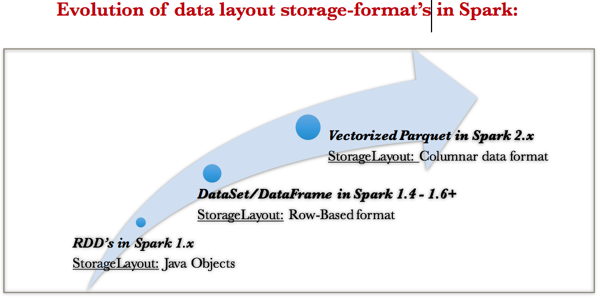

# 스파크 SQL과 데이터세트

## 자바와 스칼라를 위한 단일 API
* 데이터세트는 강력한 형식의 객체를 위하여 통합되고 단일화된 API를 제공함.
* 오직 스칼라와 자바만이 강력하게 형식화된 타입으로 지정된다.

### 데이터세트를 위한 스칼라 케이스 클래스와 자바빈
* Dataset[T]를 생성하기 위해서 T는 스칼라에서 형식화된 객체이기 때문에 객체를 정의하는 case class가 필요하다.

```scala
// 스칼라 예제
case class Blogger(
    id: Int, first: String, last: String, url: String, date: String, hits: Int, campaigns: Array[String]
)

val bloggers = "../data/bloggers.json"
val bloggersDS = spark.read.format("json")
                           .option("path", bloggers)
                           .load()
                           .as[Blogger]
```
분산 데이터 컬렉션 결과의 각 행은 위와 같이 Blogger 유형으로 정의된다.

```java
// 자바 예제
import org.apache.spark.sql.Encoders;
import java.io.Serializable;

public class Blogger implements Serializable {
    private int id;
    private String first;
    private String last;
    private String url;
    private String date;
    private int hits;
    private List<String> campaigns;
    
    // JavaBean getters and setters
    int getID() { return id; }
    void setID(int i) { id = i; }
    String getFirst() { return first; }
    void setFirst(String f) { first = f; }
    String getLast() { return last; }
    void setLast(String l) { last = l; }
    String getURL() { return url; }
    void setURL(String u) { url = u; }
    String getDate() { return date; }
    void setDate(String d) { date = d; }
    int getHits() { return hits; }
    void setHits(int h) { hits = h; }
    
    List<String> getCampaigns() { return campaigns; }
    void setCampaigns(List<String> c) { campaigns = c; }
}

// 인코더 생성
Encoder<Blogger> BloggerEncoder = Encoders.bean(Blogger.class);
String bloggers = "../blogger.json";
Dataset<Blogger> bloggerDS = spark.read.format("json")
                                       .option("path", bloggers)
                                       .load()
                                       .as(BloggerEncoder);
```

* 데이터 프레임은 스파크가 스키마를 유추할 수 있지만 데이터세트는 데이터 유형을 미리 ㅈ어의하고 케이스 클래스또는 자바빈 클래스가 일치해야 한다.


## 데이터세트 작업

데이터세트를 생성하는 간단하고 동적인 방법은 SparkSession 인스턴스를 사용하는 방법임.

### 샘플 데이터 생성
```scala
// 스칼라 예제
import scala.util.Random._

// 데이터세트를 위한 케이스 클래스
case class Usage(uid: Int, uname: String, usage: Int)
val r = new scala.util.Random(42)

// 스칼라 Usage 클래스의 1000개 인스턴스 생성
// 데이터를 생성
val data = for (i <- 0 to 1000)
    yield (Usage(i, "user-" + r.alphanumeric.take(5).mkString(""),
    r.nextInt(1000)))
    
// Usage 형태의 데이터세트 생성
val dsUsage = spark.createDataset(data)
dsUsage.show(10)
```

```java
// 자바 예제
import org.apache.spark.sql.Encoders;
import org.apache.commons.lang3.RandomStringUtils;
import java.io.Serializable;
import java.util.Random;
import java.util.ArrayList;
import java.util.List;

// 자바빈으로 자바 클래스 생성
public class Usage implements Serializable {
    int uid;
    String uname;
    int usage;
    
    public Usage() {
    }
    public Usage(int uid, String uname, int usage) {
        this.uid = uid;
        this.uname = uname;
        this.usage = usage;
    }
    
    // JavaBean getters and setters
    public int getUid() { return this.uid };
    public void setUid(int uid) { this.uid = uid; }
    public String getUname() { return this.uname; }
    public void setUname(String uname) { this.uname = uname; }
    public int getUsage() { return this.usage; }
    public void setUsage(int usage) { this.usage = usage; }
    
    public Usage() {
    }
    
    public String toString() {
        return "uid: '" + this.uid + "', uname: '" + this.uname + "', usage: '" + this.usage + "'";
    }
}

// 명시적 인코더 생성
Encoder<Usage> usageEncoder = Encoders.bean(Usage.class);
Random rand = new Random();
rand.setSeed(42);
List<Usage> data = new ArrayList<Usage>()

// 자바 Usage 클래스의 1000개 인스턴스 생성
for (int i = 0; i < 1000; i++) {
    data.add(new Usage(i, "user" + RandomStringUtils.randomAlphanumeric(5), rand.nextInt(1000)));
}

// Usage 형태의 데이터세트 생성
Dataset<Usage> dsUsage = spark.createDataset(data, usageEncoder);
```

자바에서는 위와 같이 명시적 인코더를 사용해야 한다.

### 샘플 데이터 변환

#### 고차 함수 및 함수형 프로그래밍
```scala
// 스칼라 예제
import org.apache.spark.sql.functions._

// filter()를 이용한 조건
dsUsage.filter(d => d.usage > 900)
       .orderBy(desc("usage"))
       .show(5, false)
       
// 함수를 정의하고 filter() 함수의 인수로 제공
def filterWithUsage(u: Usage) = u.usage > 900
dsUsage.filter(filterWithUsage(_)).orderBy(desc("usage")).show(5)
```
위 두 가지 방법 모두 분산된 데이터세트에서 Usage 객체의 각 행에 반복되어 람다 식을 적용하거나 함수를 실행하여 값이 참인 행에 대해 새로운 Usage 데이터 세트를 반환한다.

```java
// 자바 필터 함수 예제
FilterFunction<Usage> f = new FilterFunction<Usage>() {
    public boolean call(Usage u) {
        return (u.usage > 900);
    }
};

// 함수를 사용하여 필터를 수행하고 결과를 내림차순으로 정렬
dsUsage.filter(f).orderBy(col("usage").desc()).show(5);
```
자바에서는 FilterFunction<T> 유형을 이용하여 필터링할 수 있다. 인라인 또는 명명된 함수를 사용하여 정의할 수 있다.

불린값으로 평가해야 하는 것 뿐만 아니라 계산된 값도 반환할 수 있다.
```scala
// 스칼라 예제
// if-then-else 람다식을 사용하여 계산
dsUsage.map { u =>
    if (u.usage > 750) u.usage * 0.1
    else u.usage * 0.50
}.show(5, false)

// 사용량을 계산하는 함수 정의
def computeCostUsage(usage: Int): Double = {
    if (usage > 750) usage * 0.15 else usage * 0.50
}

dsUsage.map(u => computeCostUsage(u.usage)).show(5, false)
```

## 데이터세트 및 데이터 프레임을 위한 메모리 관리
https://spoddutur.github.io/spark-notes/deep_dive_into_storage_formats.html
* Spark 1.0은 RDD 기반 자바 객체를 이용하여 메모리 스토리지, 직/역직렬화를 이용했지만 비용이 많이 들고 속도가 느렸다. JVM의 GC에 좌우됨
* Spark 1.x - 텅스텐 (오프셋과 포인터 이용), 인코더
* Spark 2.x - 2세대 텅스텐 엔진



<br>

## 데이터 집합 인코더

* 오프 힙 메모리의 데이터를 JVM 자바 객체로 변환
* 데이터세트 객체를 직렬화하고 역직렬화

### 스파크 내부 형식과 자바 객체 형식 비교
* 자바 객체에는 헤더 정보, 해시 코드, 유니코드 정보 등 큰 오버헤드가 있음
* 스파크는 오프 힙 자바 메모리를 할당하여 데이터를 레이아웃하고 JVM 객체로 변환함

### 직렬화 및 역직렬화
* 클러스터내 노드들 사이에에서 데이터가 네트워크를 통해 자주 이동
* JVM에는 자체 직렬화기, 역직렬화기가 내장되어 있지만 비효율적이고 느리다.
* 인코더는 메모리 주소와 오프셋이 있는 간단한 포인터 계산을 사용하여 빠르게 직렬화할 수 있고 스파크 내부 표현으로 이진 표현을 빠르게 역직렬화할 수 있다.

<br>

## 데이터세트 사용 비용

### 비용 절감 전략
* 과도한 직/역직렬화를 완화하기 위해 쿼리에서 DSL 표현을 사용하고 람다를 고차 함수에 대한 인수로 사용하여 익명성을 높이는 것을 피하기
* 직/역직렬화가 최소화되도록 쿼리를 연결하기
