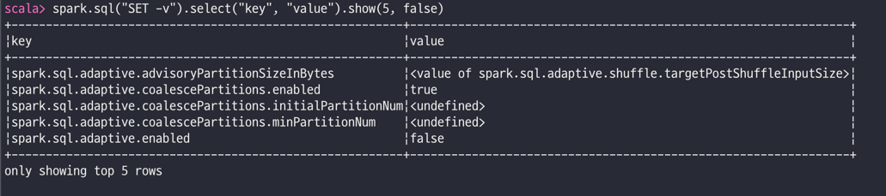

# 스파크 애플리케이션의 최적화 및 튜닝

## 효율적으로 스파크를 최적화하고 튜닝하기

* https://spark.apache.org/docs/latest/tuning.html
* https://spark.apache.org/docs/latest/configuration.html 

### 아파치 스파크 설정 확인 및 세팅
* 설정 파일들을 통한 방법
  * `$SPARK_HOME`에 `conf/spark-defaults.conf.template`, `conf/log4j.properties.template`, `conf/spark-env.sh.template`파일들이 있는데 `.template`를 지우고 설정
* 스파크 애플리케이션 안에서 혹은 `spark-submit` 제출시에 `--conf` 옵션을 사용해서 지정하는 방법
  * ```shell
    $ spark-submit --conf spark.sql.shuffle.partitions=5 --conf "spark.executor.memory=2g" --class main.scala.chapter7.SparkConfig_7_1 jars/main- scala-chapter7_2.12-1.0.jar
    ```
  * ```scala
    // 스칼라 예제
    import org.apache.spark.sql.SparkSession
    
    def printConfigs(session: SparkSession) = {
        // 설정값을 받아옴
        val mconf = session.conf.getAll
        // 설정값 출력
        for (k <- mconf.keySet) println(s"${k} -> ${mconf(k)}\n")
    }
    
    def main(args: Array[String]) = {
        val spark = SparkSession.builder
                                .config("spark.sql.shuffle.partitions", 5)
                                .config("spark.executor.memory", "2g")
                                .master("local[*]")
                                .appName("SparkConfig")
                                .getOrCreate()
        printConfigs(spark)
        spark.conf.set("spark.sql.shuffle.partitions", spark.sparkContext.defaultParallelism)
        println("****** Setting Shuffle Partitions to Default Parallelism")
        printConfigs(spark)
    }
    ```
    
* 스파크 셸에서 프로그래밍 인터페이스를 통한 방법
  * 셸에서 위와 같은 코드 이용
  * ```scala
    // 스칼라예제
    spark.sql("SET -v").select("key", "value").show(5, false)
    ```
    
* `spark.conf.isModifiable("<설정필드 이름>")`을 이용하여 변경 가능한지 확인
  
* 설정값을 결정하는 우선순위
  * spark-default.conf
  * spark-submit할 때의 설정
  * SparkSession을 통해 설정된 값

<br>

### 대규모 워크로드를 위한 스파크 규모 확장
* Tuning Apache Spark for Large Scale Workloads - https://www.youtube.com/watch?v=5dga0UT4RI8
* Hive Bucketing in Apache Spark - https://www.youtube.com/watch?v=6BD-Vv-ViBw

<br>

**정적/동적 자원 할당**
* spark-submit을 통해 자원량을 지정하는 것은 정적 할당 - 태스크가 기다리더라도 더 추가적인 자원을 할당할 수 없음
* 동적 자원 할당 - 컴퓨팅 자원을 더 할당하거나 줄이도록 요청
* 동적 할당 설정
  * spark.dynamicAllocation.enabled true
  * spark.dynamicAllocation.minExecutors 2
  * spark.dynamicAllocation.schedulerBacklogTimeout 1m --> 1분 이상 스케줄링되지 않은 태스크들이 기다리고 있다면 이그제큐터가 실행되도록 요청
  * spark.dynamicAllocation.maxExecutors 20
  * spark.dynamicAllocation.executorIdleTimeout 2min
* https://spark.apache.org/docs/latest/configuration.html#dynamic-allocation

<br>

**스파크 이그제큐터의 메모리와 셔플 서비스 설정**
* 각 이그제큐터에서 사용 가능한 메모리 양 - `spark.executor.memory`
* 예비 메모리에 300MB 할당 후 실행 메모리 60%, 저장 메모리 40% (`spark.memory.fraction`을 이용해 변경 가능)
* https://spark.apache.org/docs/latest/tuning.html#memory-management-overview

| 설정 이름                           | 기본값, 추천값, 설명                                                                        |
|---------------------------------|-------------------------------------------------------------------------------------|
| spark.driver.memory             | 기본값은 1GB로 스파크 드라이버가 이그제큐터들에게 할당되는 메모리 양. spark-submit의 `--driver-memory` 옵션에 의해 변경됨 |
| spark.shuffle.file.buffer       | 기본값은 32KB로 1MB를 추천함. 스파크가 맵 결과를 디스크에 쓰기 전에 버퍼링을 더 많이 할 수 있게함.                       |
| spark.file.transferTo           | 기본값은 true로 false로 바꾸면 스파크가 디스크에 쓰기 전 파일 버퍼를 사용하도록 하며 I/O 횟수를 줄일 수 있음                |
| spark.shuffle.unsafe.file.output.buffer | 기본값은 32KB로 셔플 작업 중 파일을 병합할 때 가능한 버퍼의 양을 조절함                                         |
| spark.shuffle.service.index.cache.size | 기본값은 100MB이다. 엔트리들 개수는 지정된 메모리 용량에 따라 제한됨                                           |
| spark.shuffle.registration.timeout | 기본값은 5000ms인데 120,000ms로 올리는 것이 좋음. 셔플 서비스 등록을 위한 최대 대기 시간                          |
| spark.shuffle.registration.maxAttempts | 기본값은 3이고 필요하다면 5정도로 사용. 셔플 서비스 등록 실패 시 재시도 횟수를 결정                                   |

<br>

**파티션은 어떻게 만들어지는가**
* 스파크의 태스크들은 데이터를 디스크에서 읽어 메모리로 올리면서 파티션 단위로 처리함
* 기본적으로 데이터 저장소는 64~128MB의 파일 크기를 갖는 파일 블록으로 구성되는데 이런 블록들의 연속된 모음이 하나의 파티션을 구성함.
* `spark.sql.files.maxPartitionBytes`를 통해 한 파티션의 크기가 결정됨
* 데이터 프레임 API를 이용해서 설정 가능
  ```scala
  val ds = spark.read.textFile("../README.md").repartition(16)
  ds.rdd.getNumPartitions
  
  val numDF = spark.range(1000L * 1000 * 1000).repartition(16)
  numDF.rdd.getNumPartitions
  ```
  
* `spark.sql.shuffle.partitions`를 통해 셔플 파티션 지정 가능 (기본값은 50)
* Tuning Apache Spark for Large Scale Workloads : https://www.youtube.com/watch?v=5dga0UT4RI8
* Hive Bucketing in Apache Spark : https://www.youtube.com/watch?v=6BD-Vv-ViBw&t=645s
* Why you should care about data layout in the filesystem : https://www.youtube.com/watch?v=F9QhzT_YTWw

<br>

## 데이터 캐싱과 영속화
* `cache()`,  `persist()`
* cache()를 호출하면 그 안에서 persist()를 호출함.

<br>

### DataFrame.cache()
* 허용되는 메모리 수준만큼 이그제큐터들의 메모리에 읽은 파티션을 최대한 저장하려고 함
* cache()나 persist()를 사용할 때 데이터프레임은 모든 레코드를 접근하는 액션을 호출하기 전까지는 완전히 캐시되지 않음
```scala
// 천만 개의 레코드를 가지는 데이터 프레임 생성
val df = spark.range(1 * 10000000).toDF("id").withColumn("square", $"id" * $"id")
df.cache()  // 데이터 캐싱
df.count()  // 캐시 수행 

df.count()  // 재수행해보면 속도가 빨라진 것을 볼 수 있음.
```

<br>

### DataFrame.persist()
* persist(StorageLevel.LEVEL) 호출 방식은은 StorageLevel을 통해 데이터가 어떤 방식으로 캐시될 것인지 제어할 수 있다는 느낌

| StorageLevel        | 설명                                                   |
|---------------------|------------------------------------------------------|
| MEMORY_ONLY         | 데이터가 곧바로 객체 형태로 메모리에 저장됨                             |
| MEMORY_ONLY_SER     | 데이터가 직렬화되어 바이트 배열 형태로 메모리에 저장됨. 사용시 역직렬화를 위한 비용이 소모됨 |
| MEMORY_AND_DISK     | 데이터가 곧바로 메모리에 저장되지만 부족한 경우 직렬화되어 디스크에 저장됨.           |
| DISK_ONLY           | 데이터가 직렬화되어 디스크에 저장됨                                  |
| OFF_HEAP            | 데이터가 오프힙(off-heap) 메모리에 저장됨.                         |
| MEMORY_AND_DISK_SER | 메모리에 저장되는 데이터가 직렬화된다. (디스크에 저장되는 데이터는 항상 직렬화됨)       |

* https://spark.apache.org/docs/latest/rdd-programming-guide.html#rdd-persistence 
* https://spark.apache.org/docs/latest/tuning.html#data-serialization
* https://www.waitingforcode.com/apache-spark/apache-spark-off-heap-memory/read

```scala
import org.apache.spark.storage.StorageLevel

val df = spark.range(1 * 10000000).toDF("id").withColumn("square", $"id" * $"id")
df.persist(StorageLevel.DISK_ONLY)
df.count()

df.count()
```

### 캐시나 영속화의 사용
* 자주 접근하는 데이터 프레임들일 때 사용
* 메모리에 들어가기에 너무 큰 데이터프레임에서는 미사용

## 스파크 조인의 종류
* 모든 조인 연산들(트랜스포메이션)은 스파크 이그제큐터들 사이에 방대한 데이터 이동을 일으킴
* 스파크가 어떤 데이터를 생성하고 디스크에 쓰고, 어떻게 키와 데이터들을 노드들에 옮기는지를 일반적으로 셔플shuffle이라고 함
* 다섯 종류의 조인 전략 (브로드캐스트 해시 조인, 셔플 해시 조인, 셔플 소트 머지 조인, 브로드캐스트 네스티드 루프 조인, 셔플 복제 네스티드 루프 조인)

<br>

### 브로드캐스트 해시 조인
* 다른 용어로 맵사이드 조인. 
* 한쪽은 데이터가 작고(기본적으로 10MB이하) 한쪽은 큰 두 종류의 데이터를 조인
```scala
import org.apache.spark.sql.functions.broadcast
val joinedDF= playersDF.join(broadcast(clubsDF), "key1 === key2")
```
* BHJ는 가장 쉽고 빠른 조인 형태
* `joinedDF.explain(mode)`를 통해 물리적 계획 확인 가능 
* Mode에는 "simple", "extended", "codegen", "cost", "formatted"가 있음.

### 셔플 소트 머지 조인
* 소트 머지 알고리즘은 정렬 가능하고 겹치지 않으면서 공통 파티션에 저장 가능한 공통 키를 기반으로 큰 두 종류의 데이터세트를 합치는 방법
* 정렬과 머지 단계를 거침
* spark.sql.join.preferSortMergeJoin 설정 이

```scala
// 스칼라 예제
import scala.util.Random
// 대용량 조인을 위한 설정들
// 브로드캐스트 조인을 비활성화한다.
// 데이터를 생성한다.
spark.conf.set("spark.sql.autoBroadcastJoinThreshold", "-1")

// 두 데이터세트를 위한 샘플 데이터를 생성한다.
var states = scala.collection.mutable.Map[Int, String]()
var items = scala.collection.mutable.Map[Int, String]()
var rnd = new scala.util.Random(42)

// 구매한 상품들과 주를 초기화
states += (0 -> "AZ", 1 -> "CO", 2 -> "CA", 3 -> "TX", 4 -> "NY", 5 -> "MI")
items += (0 -> "SKU-0", 1 -> "SKU-1", 2 -> "SKU-2", 3 -> "SKU-3", 4 -> "SKU-4", 5 -> "SKU-5")

// 데이터 프레임 생성
val usersDF = (0 to 10000).map(id => (id, s"user_${id}", s"user_${id}@databricks.com", states(rnd.nextInt(5)))).toDF("uid", "login", "email", "user_state")
val ordersDF= (0 to 10000).map(r => (r, r,  rnd.nextInt(10000), 10 * r *  0.2d, states(rnd.nextInt(5)), items(rnd.nextInt(5)))).toDF("transaction_id", "quantity", "users_id", "amount", "state", "items")
                            
// 조인 수행
val usersOrdersDF = ordersDF.join(usersDF, $"users_id" === $"uid")

// 조인 결과 확인
usersOrdersDF.show(false)                                                        
```

<br>

**셔플 소트 머지 조인 최적화**
* 빈번하게 동등 조건 조인을 수행하고 싶으면 정렬된 키나 칼럼을 위한 파티션된 버킷을 만들면 Exchange 단계를 없앨 수 있음.

```scala

```

**어떤 경우에 셔플 소트 머지 조인을 사용해야 하는가**
* 두 큰 데이터세트의 각 키가 정렬 및 해시되어 스파크에서 동일 파티션에 위치할 수 있을 때
* 동일 조건 조인만을 수행하여 정렬된 동일 키 기반으로 두 데이터세트를 조합하기 원할 때
* 네트워크 간에 규모가 큰 셔플을 일으키는 Exchange와 Sort 연산을 피하고 싶을 때 

<br>

## 스파크 UI 들여다보기

### 스파크 UI 탭 둘러보기 

**Jobs와 Stage 탭**
* 스파크는 잡, 스테이지, 태스크 단위로 나누어서 처리
* 개별 태스크의 디테일을 확인 가능
* 완료 상태와 I/O 관련 수치, 메모리 소비량, 실행 시간등


* Duration 컬럼 : 각 잡이 완료되기까지 걸린 시간. 이 숫자가 크다면 해당 잡의 스테이지를 살펴봐야함.


* Stages 탭은 모든 잡의 모든 스테이지의 현재 상태에 대한 요약을 제공


* Stage를 클릭하면 DAG와 태스크의 디테일 정보를 볼  수 있음 

**Executors 탭**


* 상제 자원 사용량 (디스크, 메모리, CPU코어), GC 수행시간, 데이터 양
* cache()나 persist()를 썼을 때 사용량을 확인하는 데 도움이 됨.

**Storage 탭**
* cache()나 persist()의 결과로 애플리케이션에서 캐시된 데이터 프레임이나 테이블의 정보를 제공함.

**SQL 탭**
* 스파크 SQL 쿼리의 효과

**Environment 탭**
* 스파크 애플리케이션이 돌아가고 있는 환경