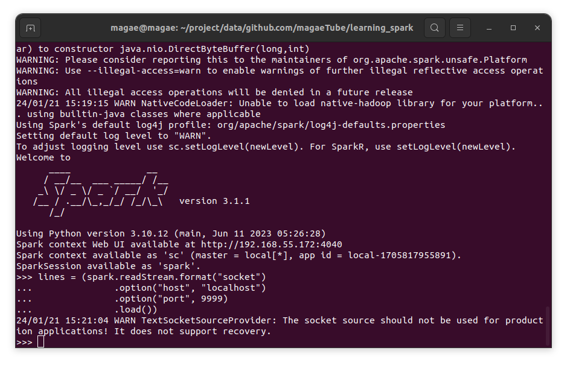

# 정형화 스트리밍

## 아파치 스파크의 스트림 처리 엔진의 진화
* 스트림 : 끝없이 들어오는 데이터 흐름을 연속적으로 처리하는 것.
* 전통의 방식은 **레코드 단위 처리 모델**로 구현.
* 각 노드는 한번에 하나씩 레코드를 받아 처리함.
* 장애 복구에 좋지 않음.

### 마이크로 배치 스트림 처리
* 스트리밍 처리를 아주 작은 맵리듀스 스타일 배치 처리 잡 형태 (마이크로 배치)
* 장점
  * 태스크를 빠르게 다른 이그제큐터들로 복제해 장애나 속도 저하에 대해 대응
  * 통제된 태스크의 할당은 태스크가 여러 번 실행되더라도 동일한 결과를 보여줌.
* 단점
  * 웬만한 파이프라인은 초 단위 이하의 반응 속도를 필요하지 않음
  * 파이프라인의 다른 부분들에 더 큰 지연이 있는 경우가 있음.

### 스파크 스트리밍에서 얻은 교훈
* 배치나 스트림 처리를 위한 단일 API 부재
* 논리/물리 계획 간에 구분 구족
* 이벤트 타임 윈도우를 위한 기본 지원 부족

### 정형화 스트리밍의 철학
* 배치 및 스트림 처리를 위한 단일화된 프로그래밍 모델과 인터페이스
* 더 넓은 범위의 스트리밍 처리 지원

## 정형화 스트리밍의 프로그래밍 모델
* 정형화 스트리밍은 테이블이라는 개념을 확장하여 무한하게 연속적으로 데이터가 추가되는 테이블의 개념으로 간주되었음
* 개발자들은 일반 쿼리를 정의해 던지고 정형화 스트리밍은 이 배치 스타일 쿼리를 스트리밍 실행 계획으로 변환하는데 이를 증식화(incrementalization)이라고 함.
* 모델의 마지막 부분은 결과 모드로 파일 시스템(HDFS, S3)이나 데이터베이스(MySQL, 카산드라)에 저장됨.
  * append, update, complete 모드

## 정형화 스트리밍 쿼리의 기초

### 스트리밍 쿼리를 정의하는 다섯 단계

#### 1단계: 입력 소스 지정
* 스트리밍 소스로부터 데이터 프레임을 지정
* DataStreamReader를 만들어주는 spark.readStream을 사용해야 함.
* 소켓 외에도 카프카와 파케이, ORC, JSON 등에서 데이터 스트림을 읽어들일 수 있게 지원함. 

```python
spark = SparkSession...
lines = (spark.readStream.format("socket")
              .option("host", "localhost")
              .option("port", 9999)
              .load())  
```



#### 2단계: 데이터 변형
* 라인을 개별 단어로 나누고 카운트를 진행

```python
from pyspark.sql.functions import *
words = lines.select(split(col("value"), "\\s").alias("word"))
counts = words.groupBy("word").count()
```
* counts 변수는 스트리밍 데이터 프레임이며 스트리밍이 시작되고 입력이 지속적으로 처리되며 계산을 수행함.
* 상태 정보가 없는 트랜스포메이션
  * `select()`, `filter()`, `map()` 같은 연산들은 다음 행 처리를 위해 이전 행 정보를 필요로 하지 않음. 이러한 무상태 연산들은 배치와 스트리밍 양쪽에 사용 가능함.
* 상태정보 유지 트랜스포메이션
  * `count()` 같은 집계 연산은 여러 행에 걸쳐서 데이터가 정보를 유지하고 있기를 요구함. 정형화 스트리밍에서 지원되지만 일부 조합은 지원되지 않음.

#### 3단계: 출력 싱크와 모드 결정
* 데이터 변형 후 `DataFrame.writeStream`을 써서 어떻게 쓰일지 정할 수 있음.
```python
writer = counts.writeStream.format("console").outputMode("complete")
```
* 모드
  * Append 모드
  * Complete 모드
  * Update 모드
* 출력은 파일과 카프카에 쓰는 것도 지원함. `foreachBatch()`와 `foreach()` API를 사용하여 임의의 위치에 쓰는 것도 가능

#### 4단계: 처리 세부사항 지정
```python
checkpointDir = "test"
writer2 = (writer.trigger(processingTime="1 second")
                 .option("checkpointLocation", checkpointDir))    
```
* 트리거링 상세 내용
  * 기본(default) : 스트리밍 쿼리는 마이크로 배치가 완료되자마자 다음 마이크로 배치가 실행되는 곳부터 데이터를 실행
  * 트리거 간격에 따른 처리 시간 : `processingTime`을 이용해 간격을 지정
  * 일회 실행 : 이 모드는 하나의 마이크로 배치를 실행함. 
  * 연속(continuous): 연속적으로 데이터를 처리하는 모드

#### 5단계: 쿼리 시작
```python
streamingQuery = writer2.start()
```
* start()는 논블로킹 함수이므로 백그라운드에서 쿼리를 실행하고 호출한 즉시 객체를 리턴함.

## 실행 중인 스트리밍 쿼리의 내부
* 스파크 SQL이 스트리밍 특성에 따라 실행할 수 있는지 확인하기 위해 논리 계획을 분석하고 최적화함
* 스파크는 백그라운드 스레드를 통해 아래 내용을 반복함
  * 트리거 간격마다 새 데이터가 있는지 확인
  * 새 데이터가 있으면 마이크로 배치로 실행. 논리 계획으로부터 최적화된 실행 계획이 생성되며 업데이트된 결과를 계산해 내고 출력.
  * 지정된 체크포인트 위치에 정확한 처리 데이터 범위와 연관된 상태들을 저장.
* 다음 이유로 종료되기 전까지 계속 실행함.
  * SQL에서 오류 발생
  * `streamingQuery.stop()` 호출에 의해 중단
  * 일회 실행으로 설정되어 있다면 실행 후 종료

### 정확한 일회 실행을 위한 장애 복구
* 체크포인트 위치는 스트리밍 쿼리를 구분하는 ID를 갖고 있으며 라이프 사이클을 표시하기 때문에 재시작할 때도 동일하게 유지되어야함.
* 정형화 스트리밍은 아래 조건들이 만족될 때 전체적으로 정확한 일회 실행을 함.
  * 재실행 가능한 스트리밍 소스
  * 결정론적 연산 (동일한 결과)
  * 멱등성 스트리밍 싱크
  * 데이터 프레임 트랜스포메이션
  * 소스와 싱크 옵션들 
  * 상세한 부분 처리

### 동작 중인 쿼리 모니터링하기
* `StreamingQuery`를 이용하여 가능함.
* `lastProgress()` : 가장 마지막에 완료된 마이크로 배치에 대한 정보
  * id : 체크포인트 위치 단독 식별자
  * runId : 현재 시작된 쿼리 인스턴스 식별자
  * numInputRows : 마지막 마이크로 배치에서 처리된 레코드 개수
  * inputRowsPerSecond : 지난 마이크로 배치 시간 동안의 평균
  * processedRowsPerSecond : 처리되고 싱크에 의해 쓰여진 레코드 비율
  * sources/sink : 데이터의 소스와 싱크에 대한 정보
* `status()`: 현재 상태
  * 드롭위저드 메트릭 라이브러리르 사용해서 통계 정보 발행
  * `spark.sql.streaming.metricsEnabled` 설정을 true로 하여 메트릭 설정
  * 자체 제작한 `StreamingQueryListener`를 써서 통계 수치 발행 (스칼라나 자바에서만 사용 가능)

## 스트리밍 데이터 소스와 싱크

### 파일
* 일반 텍스트 파일, CSV, JSON, 파케이, ORC 등
* 모든 파일들은 동일한 포맷이어야 하고 스키마는 정의된 것과 일치해야 한다.
* 각 파일은 디렉터리에서 완전한 하나의 파일로 존재해야 함. (수정, 업데이트 x)
* 처리량 제한으로 처리해야할 여러 파일 중 일부만 처리될 수 있음

```python
# 파일에서 읽기
from pyspark.sql.types import *
inputDirectoryOfJsonFiles = ...

fileSchema = (StructType().add(StructField("key", IntegerType()))
                          .add(StructField("value", IntegerType())))

inputDF = (spark.readStream.format("json")
                           .schema(fileSchema)
                           .load(inputDirectoryOfJsonFiles))

# 파일 쓰기
outputDir = ...
checkpointDir = ...
resultDF = ...

streamingQuery = (resultDF.writeStream.format("parquet")
                                      .option("path", outputDir)
                                      .option("checkpointLocation", checkpointDir)
                                      .start())
```

### 아파치 카프카
```python
# 카프카에서 읽기
# events 토픽에서 데이터 읽기
inputDF = (spark.readStream.format("kafka")
                           .option("kafka.bootstrap.servers", "host1:port1,host2:port2")
                           .option("subscribe", "events")
                           .load())

# 카프카에 쓰기
counts = ... 
streamingQuery = (counts.selectExpr("cast(word as string) as key",
                                    "cast(count as string) as value")
                        .writeStream.format("kafka")
                                    .option("kafka.bootstrap.servers", "host1:port1,host2:port2")
                                    .option("topic", "wordCounts")
                                    .outputMode("update")
                                    .option("checkpointLocation", checkpointDir)
                                    .start()) 
```

* 카프카 소스에서 생성된 데이터 프레임의 스키마

|컬럼명|타입| 설명                  |
|-----|----|---------------------|
|key|binary| 바이트로 구성된 레코드의 키 데이터 |
|value|binary| 바이트로 구성된 레코드의 값 데이터 |
|topic|string|레코드가 있었던 토픽|
|partition|int|카프카 토픽의 파티션|
|offset|long|레코드의 오프셋 값|
|timestamp|long|레코드 타임스탬프|
|timestampType|int|타임스탬프의 타입|


### 자체 제작 스트리밍 소스와 싱크
* `foreachBatch()`와 `foreach()`를 사용하여 임의의 저장 시스템에 쓴다.
* `foreachBatch()`: 각 마이크로 배치 출력마다 실행되는 함수를 지정 
  * 기존 배치 데이터 소스 재활용 가능
  * 여러 곳에서 사용 가능
* `foreach()`: 레코드마다 자체 쓰기 로직을 적용

```python
# foreachBatch()
hostAddr = ""
keyspaceName = ""
tableName = ""

spark.conf.set("spark.cassandra.connection.host", hostAddr)

def writeCountsToCassandra(updatedCountsDF, batchId):
    (updatedCountsDF.write.format("org.apache.spark.sql.cassandra")
                          .mode("append")
                          .options(table=tableName, keyspace=keyspaceName)
                          .save())
  
def writeCountsToMultipleLocations(updatedCountsDF, batchId):
    updatedCountsDF.persist()
    updatedCountsDF.write.format(...).save()
    updatedCountsDF.write.format(...).save()
    updatedCountsDF.unpersist()

streamingQuery = (counts.writeStream.foreachBatch(writeCountsToCassandra)
                                    .outputMode("update")
                                    .option("checkpointLocation", checkpointDir)
                                    .start())

# foreach()
def process_row(row):
    # 저장 장치에 씀
    pass

query = streamingDF.writeStream.foreach(process_row).start()

class ForeachWriter:
    def open(self, partitionId, epochId):
        # 저장 장치 열기
        pass
    
    def process(self, row):
        # 저장소에 문자열을 쓴다.
        pass

    def close(self, error):
        # 접속을 닫는다.
        pass

resultDF.writeStream.foreach(ForeachWriter()).start()
```

## 데이터 트랜스포메이션

### 누적 실행과 스트리밍 상태
* 스파크 SQL 플래너는 데이터 스트림 위에서 동작할 필요가 있는 스트리밍 논리 계획인지 판단함.
* 각 실행은 하나의 마이크로 배치로 간주되며 각 실행 사이에 주고받는 부분적인 중간 결과는 스트리밍 '상태'라고 불림

### 무상태 트랜스포메이션
* 모든 프로젝션 연산 (select(), explode(), map(), flatMap())과 선택적 연산 (filter(), where())은 이전 행에 대한 정보 없이도 각각의 입력 레코드를 개별적으로 처리함.

### 상태 정보 유지 트랜스포메이션
* groupBy().count()

## 링크
* https://people.csail.mit.edu/matei/papers/2013/sosp_spark_streaming.pdf
* https://metrics.dropwizard.io/4.2.0/
* https://spark.apache.org/docs/latest/structured-streaming-programming-guide.html#creating-streaming-dataframes-and-streaming-dataset