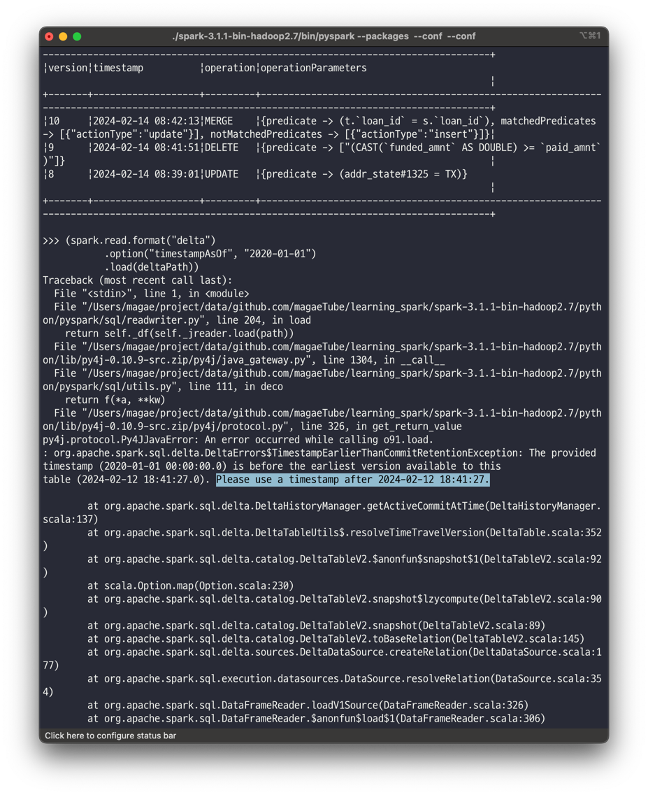

# 아파치 스파크를 통한 안정적인 데이터 레이크 구축
* 데이터베이스, 데이터 레이크, 레이크하우스

## 최적의 스토리지 솔루션의 중요성
*확장성 및 성능*  
*트랜잭션 지원(ACID)*  
*다양한 데이터 형식 지원(정형/반정형/비정형)*  
*다양한 워크로드 지원(SQL/ETL/Streaming/ML)*  
*개방성*  

<br>

## 데이터베이스
### 데이터베이스에 대한 간략한 소개
* 구조화된 데이터를 SQL쿼리를 사용하여 테이블로 저장되도록 설계
* 스키마 준수
* 데이터베이스의 SQL 워크로드
  * OLTP 워크로드: 한 번에 몇 개의 레코드를 읽거나 업데이트하는 간단한 쿼리
  * OLAP 워크로드: 정기 리포트, 많은 레코드에 대한 높은 처리량, 집계 및 조인

### 아파치 스파크를 사용하여 데이터베이스 읽기 및 쓰기
* 다양한 커넥터를 이용한 연결

### 데이터베이스의 한계
* 데이터 크기의 증가
* 분석의 다양성 증가 
* 확장하기엔 비용이 많이 듦 (분산 처리가 어려움)
* 비SQL 기반 분석을 잘 지원하지 않

<br>

## 데이터 레이크
* 범용 하드웨어에서 실행되고 쉽게 확장되는 분산 스토리지 솔루션

### 데이터 레이크 소개
* 분산 컴퓨팅 시스템에서 분산 스토리지 시스템을 분리함
* 표준 API를 사용하여 읽고 쓸 수 있도록 오픈 형식의 파일로 저장됨
* 스토리지 시스템
  * HDFS, Object Storage (S3, GCS, etc)
* 파일 형식
  * 정형 (Parquet, ORC)
  * 반정형 (JSON)
  * 비정형 (텍스트, 이미지, 오디오, 비디오)
* 처리 엔진
  * 배치 처리 엔진 (스파크, 프레스토, 하이브)
  * 스트림 처리 엔진 (스파크, 아파치 플링크)
  * 머신러닝 라이브러리 (스파크 MLlib, 사이킷런)

### 데이터 레이크에서 읽고 쓰기
* 다양한 워크로드  지원
  * 배치 처리, ETL, SQL, 스트리밍 등
* 다양한 파일 형식 지원
* 다양한 파일 시스템 지원

### 데이터 레이크의 한계
* ACID 보증이 안됨
* 원자성과 독립성
  * 분산 방식으로 기록하는데 작업이 실패하면 작성된 파일을 롤백하는 메커니즘이 없어 손상된 데이터가 남음
* 일관성
  * 실패한 쓰기에 대한 원자성 부족으로 일관성을 잃게 됨.
* 이를 위한 해결책 (트릭)
  * 대규모 데이터 파일을 "파티션" 단위로 저장해서 일부 레코드를 업데이트/삭제하기 위해 파티션 디렉터리를 다시 씀
  * 데이터에 동시 액세스 또는 데이터 불일치를 피하기 위해 업데이트 작업에 시차를 두고 실행함

<br>

## 레이크하우스
* OLAP 워크로드를 위한 데이터 레이크와 데이터웨어하우스의 요소를 결합한 새로운 패러다임
* 다음의 기능 제공
  * **트랜잭션 지원** : ACID 보장  
  * **스키마 적용 및 거버넌스** : 스키마를 통해 잘못된 데이터가 삽입되는 것을 방지  
  * **오픈 형식의 다양한 데이터 유형 지원** : 모든 유형의 데이터를 저장, 정제, 분석 및 액세스  
  * **다양한 워크로드 지원** : 다양한 워크로드가 단일 저장소의 데이터에 대해 작동
  * **업서트 및 삭제 지원** : CDC (Change Data Capture) 및 SCD (Slowly Changing Dimension) 작업을 할 때 트랜잭션 보장이 되므로 데이터를 업데이트하고 삭제할 수 있다.
  * **데이터 거버넌스**
* 아파치 후디, 아파치 아이스버그, 델타 레이크

<br>

### 아파치 후디
* 우버 엔지니어링에서 구축 (https://eng.uber.com/hoodie)
* 키/값 스타일 데이터에 대한 업서트 및 삭제를 위해 설계됨
* 열 기반 형식 (Parquet)과 행 기반 형식 (Avro) 지원
* 다음도 지원함
  * 업서트
  * 롤백 지원 --> 원자성 유지
  * 증분 변경 읽기
  * 데이터 복구를 위한 저장점
  * 통계를 이용한 파일 크기 및 레이아웃 관리
  * 행, 열 데이터의 비동기 압축

<br>

### 아파치 아이스버그
* 넷플릭스에서 구축 (https://github.com/Netflix/iceberg)
* 데이터 세트를 위한  다른 오픈 스토리지 형식으로 단일 테이블에서 페타바이트까지 증가할 수 있는 확장성과 스키마 진화 특성을 가진 범용 데이터 스토리지
* 다음도 지원함
  * 스키마 진화 기능
  * 숨겨진 파티셔닝 기능
  * 파티션 진화 기능 (테이블 레이아웃을 메타데이터에 업데이트)
  * 테이블 스냅샷을 쿼리할 수 있는 시간 탐색 기능
  * 롤백 기능

<br>

### 델타 레이크
* 스파크 창시자가 구축한 오픈 소스 프로젝트
* 테이블에서 스트리밍 읽기 및 쓰기
* 업데이트, 삭제, 업서트를 위해 자바, 스칼라, 파이썬 API 제공
* 스키마 변경 가능
* 시간 탐색 기능
* 롤백 기능

<br>

## 아파치 스파크 및 델타 레이크로 레이크하우스 구축
### 델타 레이크와 아파치 스파크 구성
* https://databricks.com/session/why-you-should-care-about-data-layout-in-the-filesystem
* 대화형 셸 설정
```shell
pyspark --packages io.delta:delta-core_2.12:0.7.0
```


<br>

### 델타 레이크 테이블에 데이터 로드
```python
# 소스 데이터 경로 설정
sourcePath = "LearningSparkV2-master/databricks-datasets/learning-spark-v2/loans/loan-risks.snappy.parquet"

# 델타 레이크 경로 설정
deltaPath = "/tmp/loans_delta"

# 같은 대출 데이터를 사용하여 델타 테이블생성
(spark.read.format("parquet").load(sourcePath)
      .write.format("delta").save(deltaPath))

# 뷰 생성
spark.read.format("delta").load(deltaPath).createOrReplaceTempView("loans_delta")

# 데이터 검색
spark.sql("SELECT count(*) FROM loans_delta").show()

# 5개 출력
spark.sql("SELECT * FROM loans_delta LIMIT 5").show()
```


<br>

### 델타 레이크 테이블에 데이터 스트림 로드
```python
newLoanStreamDF = ...
checkpointDir = ...
streamingQuery = (newLoanStreamDF.writeStream.format("delta")
                                             .option("checkpointLocation", checkpointDir)
                                             .trigger(processingTime="10 seconds")
                                             .start(deltaPath))
```
* 델타레이크에는 기존 형식(JSON, Parquet, ORC)에 비해 이점이 있음
  * 배치 처리 및 스트리밍 모두 동일한 테이블에 쓰기 가능
  * 여러 스트리밍 작업에서 동일한 테이블에 데이터 추가 가능 (트랜잭션이 가능하기에)

<br>

### 데이터 손상을 방지하기 위해 쓰기 시 스키마 적용
* 일반적인 형식을 사용할 때 잘못된 형식으로 데이터를 작성하면 데이터 손상이 발생함.
* 델타 레이크 형식은 스키마를 테이블 수준 메타데이터로 기록함.
* 그렇기에 현재 존재하는 데이터에 호환하려는 스키마가 맞는지 확인하고 안맞으면 오류를 발생시킴
```python
from pyspark.sql.functions import *

cols =  ["loan_id", "funded_amnt", "paid_amnt", "addr_state", "closed"]
items = [
  (1111111, 1000, 1000.0, "TX", True),
  (2222222, 2000, 0.0, "CA", False)
]

loanUpdates = (spark.createDataFrame(items, cols).withColumn("funded_amnt", col("funded_amnt").cast("int")))
loanUpdates.write.format("delta").mode("append").save(deltaPath)
```


### 변화하는 데이터를 수용하는 진화하는 스키마
* mergeSchema 옵션을 true로  설정하여 추가 가능함.
```python
(loanUpdates.write.format("delta").mode("append")
                  .option("mergeSchema", "true")
                  .save(deltaPath))
```

<br>

### 기존 데이터 변환
* 델타 레이크는 UPDATE, DELETE 및 MERGE 지원함

<br>

**오류 수정을 위한 데이터 업데이트**
* 기존 방식
  * 영향 받지 않는 모든 행을 새 테이블에 복사
  * 영향 받는 모든 행을 데이터 프레임에 복사하고 데이터 수정
  * 수정된 데이터 프레임을 새 테이블에 삽입
  * 이전테이블을 제거하고 새 테이블의 이름을 원래 테이블 이름으로 변경
* 델타 레이크
```python
from delta.tables import *

deltaTable = DeltaTable.forPath(spark, deltaPath)
deltaTable.update("addr_state = 'TX'", {"addr_state": "'WA'"})
```


* 위와 같이 에러남. PySpark를 실행할 때 아래와 같이 설정을 추가해야함.
```shell
pyspark --packages io.delta:delta-core_2.12:0.7.0,org.apache.hadoop:hadoop-aws:2.8.5 --conf "spark.sql.extensions=io.delta.sql.DeltaSparkSessionExtension" --conf "spark.sql.catalog.spark_catalog=org.apache.spark.sql.delta.catalog.DeltaCatalog"
```


* 위 명령어로 실행하고 진행했지만 다시 에러남
* 원인 찾아보니 DeltaLake 0.7.0 버전은 Spark 3.0.x 버전에서 가능하다고 함 (현재는 3.1.1)
* https://github.com/delta-io/delta/issues/594
* 그래서 아래와 같이 델타레이크 버전을 올림
```shell
pyspark --packages io.delta:delta-core_2.12:1.0.0,org.apache.hadoop:hadoop-aws:2.8.5 --conf "spark.sql.extensions=io.delta.sql.DeltaSparkSessionExtension" --conf "spark.sql.catalog.spark_catalog=org.apache.spark.sql.delta.catalog.DeltaCatalog"
```


<br>

**데이터 삭제**
```python
deltaTable = DeltaTable.forPath(spark, deltaPath)
deltaTable.delete("funded_amnt >= paid_amnt")
```

<br>

**Merge를 이용한 Upsert**
```python
# Merge
(deltaTable.alias("t")
           .merge(loanUpdates.alias("s"), "t.loan_id = s.loan_id")
           .whenMatchedUpdateAll()
           .whenNotMatchedInsertAll()
           .execute())
```

<br>

### 데이터 삽입 전용 병합을 사용하여 데이터 중복 제거
* 델타 레이크의 병합 작업은 고급 기능을 제공함
  * 삭제 수행
    * MERGE ... WHEN MATCHED THEN DELETE
  * 조건 구문
    * MERGE ... WHEN MATCHED AND <조건> THEN ...
  * 선택적 수행
    * 모든 MATCHED 절과 NOT MATCHED 절은 선택사항임
  * 스타 구문
    * UPDATE * (API에서 updateAll()) 및 INSERT * (API에서 insertAll())
* loan_delta 테이블에 대출 기록을 넣을 때 이미 입력된 데이터는 업데이트되지 않는 예제
```python
(deltaTable.alias("t").merge(historicalUpdates.alias("s"), "t.loan_id = s.loan_id")
                      .whenNotMatchedInsertAll()
                      .execute())  
```

<br>

### 작업 내역으로 데이터 변경 검사
* 델타 레이크 테이블에 대한 모든 변경사항은 트랜잭션 로그에 커밋으로 기록됨
* 쿼리를 통해 테이블의 작업 기록을 확인할 수 있음
```python
deltaTable.history().show()

# 일부 열 추출
(deltaTable.history(3).select("version", "timestamp", "operation", "operationParameters").show(truncate=False))
```


<br>

### 시간 탐색을 사용하여 테이블의 이전 스냅샷 쿼리
* DataFrameReader 옵션 "versionAsOf" 및 "timestampAsOf"를 사용하여 이전 버전 스냅샷 쿼리 가능
```python
(spark.read.format("delta")
           .option("timestampAsOf", "2020-01-01")
           .load(deltaPath))

(spark.read.format("delta")
           .option("versionAsOf", "4")
           .load(deltaPath))      
```


